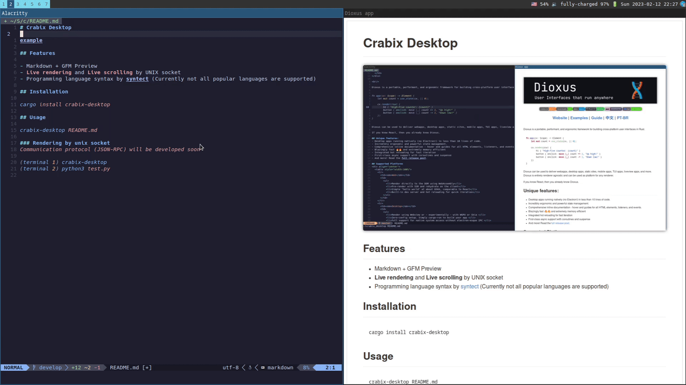

# Crabix Desktop

Experimental markdown renderer with native Desktop app on rust (Linux/MacOS)

## Features

- Markdown + GFM Preview
- **Live rendering** and **Live scrolling** by UNIX socket
- Programming language syntax by [syntect](https://github.com/trishume/syntect) (Currently not all popular languages are supported)

## Installation
```bash
cargo install crabix-desktop
```
## Usage
```bash
crabix-desktop README.md
```
### Rendering by unix socket
*Communication protocol (JSON-RPC) will be developed soon*
```bash
(terminal 1) crabix-desktop
(terminal 2) python3 test.py
```
### Neovim plugin
The [crabix-desktop.nvim](https://github.com/kurotych/crabix-desktop.nvim) plugin supports **Live rendering** and **Live scrolling**

## Contributing

I'm welcome to any kind of contribution
- Feature request
- Bug ticket
- PRs with bug fixes, refactoring, new features
