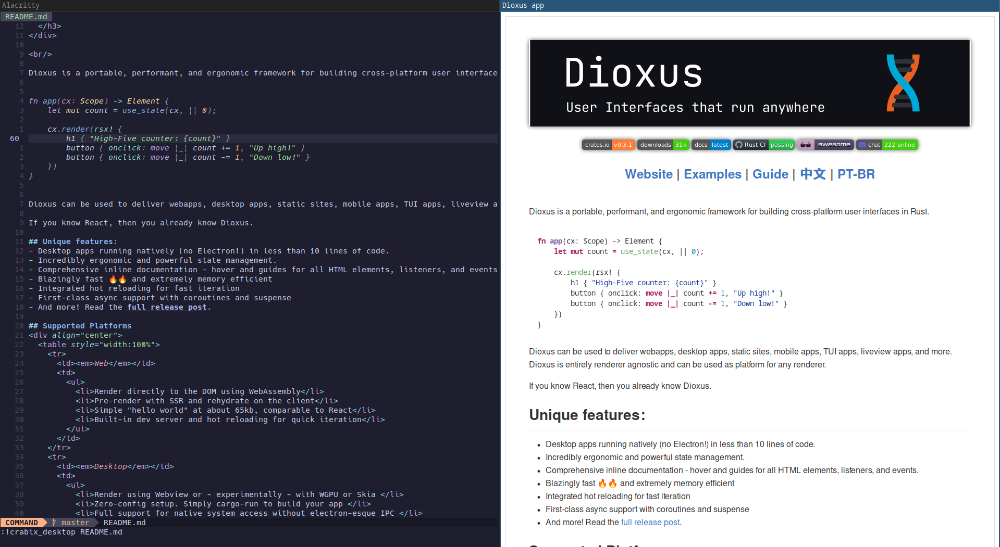

# Crabix Desktop

Experimental markdown renderer with native Desktop app on rust.   
<sup>50 lines of code,
Binary size: 5mb</sup>


## Installation
```bash
cargo install crabix-desktop
```
## Usage
```bash
crabix-desktop README.md
```
